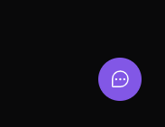
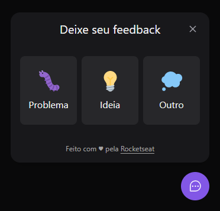
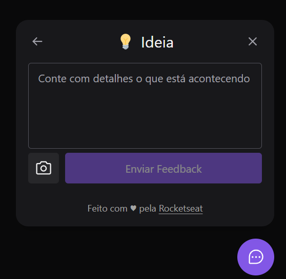
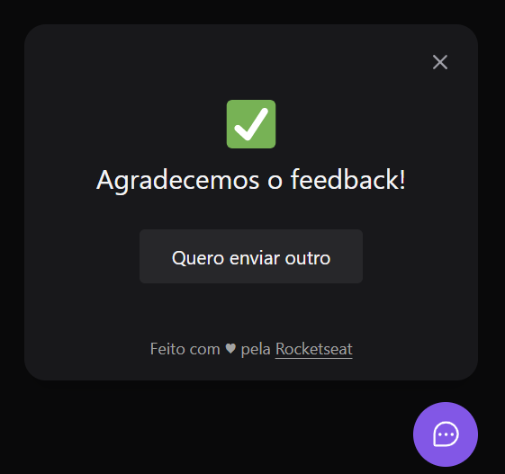

<h1 align='center'>Widget - Web</h1>
<h3 align='center'>
  <a href="#tecnologias">Tecnologias</a> |
  <a href="#sobre">Sobre</a> |
  <a href="#imagens">Images</a> |
  <a href="#pre-requisitos">Ver o projeto</a>
</h3>

# Tecnologias
Para a construção do projeto utilizei as seguintes tecnologias:
  <ul> 
    <li>JSX</li>
    <li>Tailwind</li>
    <li>JavaScript</li>
    <li>TypeScript</li>
    <li>React</li>
    <li>React - Dom</li>
    <li>Phosphoricons - biblioteca de icones</li>
  </ul>

# Sobre
<p>
  O projeto é a criação de um widget onde possa ser enviado feedbacks de uma aplicação
</p>
<p> Criado para o NLW Return  da <a target="_blank" href="https://www.rocketseat.com.br/">Rocketseat.</a></p>

## Funcionalidades

  - [X]Capturar a tela
  - [X]Envio ao back end
  - [X]Categorias de feedback
  - [X]Consumo de Api
  - [X]Acessibilidade 

# Imagens 

## Icone

<hr/>

## Pagina 1

<hr/>

## Pagina 2

<hr/>

## Pagina 3

<hr/>


# Pre-requisitos

Para testar o projeto na sua maquina você irá precisar das seguintes ferramentas:
[Git](https://git-scm.com/), [Node](https://nodejs.org/en/). Além disso é ideal usar um bom editor para trabalhar com código como o [VSCode](https://code.visualstudio.com/)

```bash
#Clone este repositorio

$ git clone <https://github.com/viteydev/nlw-return-impulse-web>

#Lembre-se de acessar a pasta do projeto

$ cd nlw-return-impulse-web

#Assim que estiver na pasta, adicione o seguinte comando
#Dessa forma as dependencias da aplicação serão baixadas e o projeto podera funcionar corretamente.

$ npm install

#Agora basta iniciar o projeto

$ npm run dev

#O servidor inciará na porta:3000 - acesse <http://localhost:3000>
```

#### Feito por Vitor para o NLW return 👍 | Veja meu [Linkedin](https://www.linkedin.com/in/vitor-lemos-1a61b3238/)
